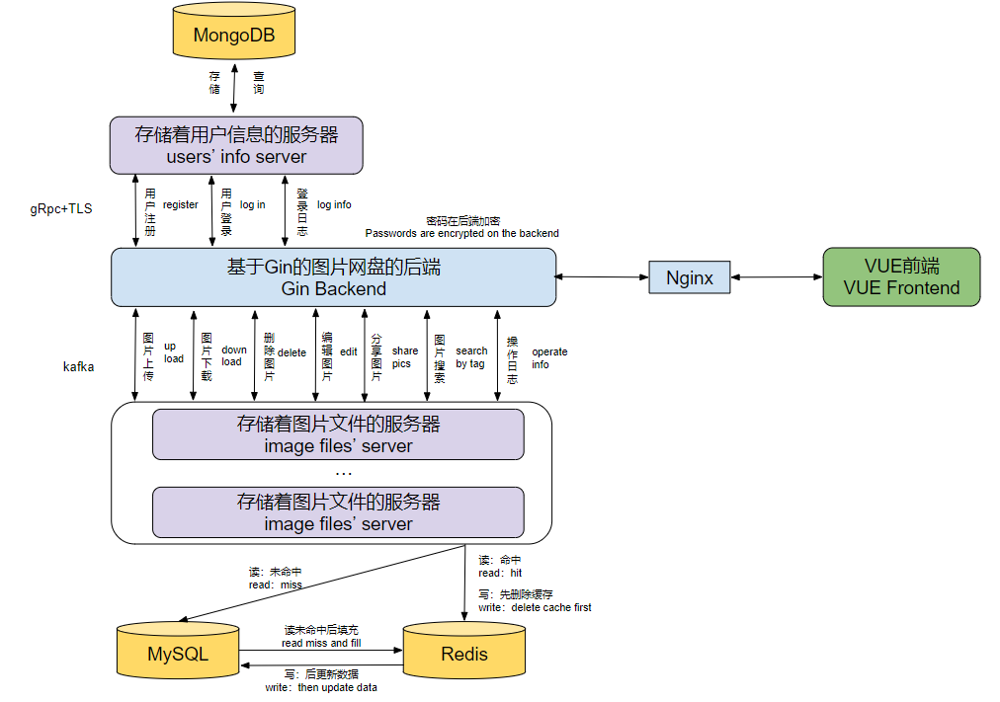

# Tmage

### Introduction
Tmage is a web-based, distributed image storage and sharing platform where users can upload images and quickly search for desired images based on tags.

---

### Tech Stack
- Frontend：VUE3
- Backend：Gin
- DataBase：MongoDB、Redis、MySQL
- Message queue：kafka
- Data deliver：gRpc
- File storage：Distributed file system

### Main Function
- User registration and login
- Images upload
- Images download
- Delete images
- Edit images
- Search images
- Storage capacity management

### System Architecture

---

### About this Project...
> The initial idea for this project came from having too many pictures on my phone (thanks to the vast internet with all sorts of meme images ^_^). Whenever I wanted to share something in a group chat, I couldn't find the images I was looking for. So, I came up with this idea.

> Now the project only has a web version, but I plan to develop iOS and Android clients in the future. Coming soon...

### PS
At present, it is still in the development stage. Feedback and suggestions are welcome！！！

